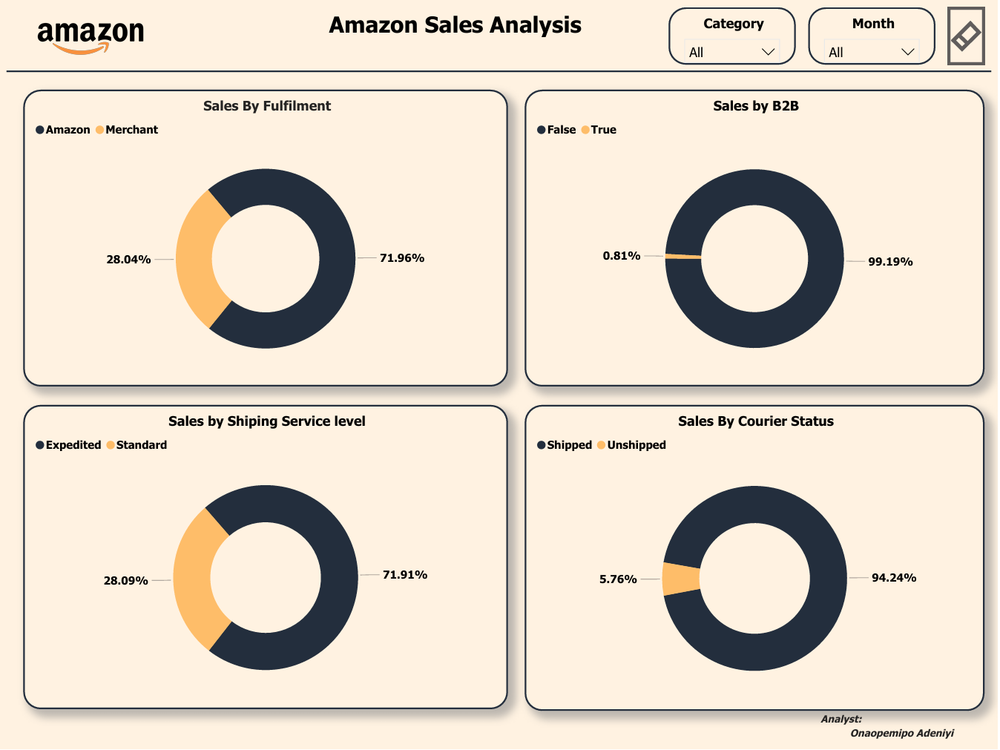

# DATALEUM-DASHBOARD-CHALLENGE-NOV-2024
This contains a Dashboard Challenge Hosted by Dataleum. We were given the liberty to choose from our post training materials any dataset that we would like to use for the contest. I selected the Amazon dataset that was in the drive provided to the students. 
## Table of Content
1.0 - Introduction

2.0 - Data Source 

3.0 - Tools Used

4.0 - Data Transformation

5.0 - Data Visualization

6.0 - Insights

## 1.0 - Introduction
The Aim of the Dashboard Challenge was to evaluate how students can make use of the charts to compell basic story and also try to maintain visual hierachy across the dashboard. The company i selected was Amazon and i tried to analyse the dataset by checking for inconsistencies in the dataset and also making sure that i have a clean dataset to work on. 

## 2.0 - Data Source
The Data Source for this challenge was provided in our drive by Dataleum. I just went there to extract the Amazon Dataset i chose. 

## 3.0 - Tools Used
3.1 -**Microsoft Excel** [Download Here](www.microsoft.com)

3.2 -**Microsoft PowerBi** [Download Here](https://app.powerbi.com/)

## 4.0 - Data Transformation 
Using Microsoft Excel, i was able to check the data for any errors and missing values. I used Power Query to perform more cleaning functions which helped me arrived at a clean dataset. 

## 5.0 - Data Visualization
With the Data Loaded on Microsoft PowerBi after cleaning from Microsoft Excel. I proceed to extract some key insights which would help me in creating a well stocked dashboard. 

## 6.0 - Insights
6.1 -*We can see some important Key Performance Indicators which was represented on a card visual to show it. Some of which are the total quantity which amounted to 114k, Total Sales which amounted to $76.02M, Total No of Orders which amounted to 113.67k, Total No of Category is 9, No of States shipped to were 46 States and also the country in focus was India.*

6.2 -*We can see the top 5 selling states to be Maharashtra, karnataka, Telangana, Uttar Pradesh and Tamil Nadu.*

6.3 -*We also can see the trend analysis of revenue across month which shows there was a spike in April where you have sales of $28m and also June being the last month with $23M.*

6.4 -*We can see that the top 4 selling catgeory are Set, Kurta, Western Dress and Top.*

6.5 -*We can see that the top 5 selling sizes and top 5 size by Quantity sold was led by both M.*

6.6 -*We can see the shipping status also that the amount shipped was $50M, compared to the ones delivered to the buyer which is $18M.*
